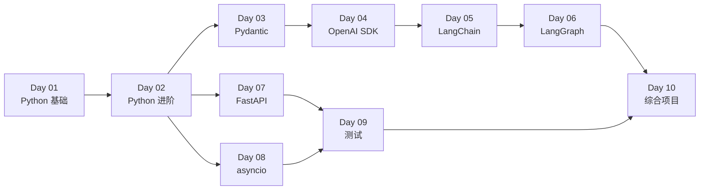

# Python Agent 开发面试速通

> 面向：熟悉 JavaScript、需要转 Python Agent 开发岗位的开发者
> 周期：10 天（每天 4-6 小时）
> 目标：通过 Python 基础检验 + 掌握 Agent 开发核心栈

## 学习路线

## 技术栈

| 包 | 版本 | 说明 |
|---|---|---|
| Python | 3.11+ | match 语法 + 新类型提示 |
| Pydantic | 2.x | Rust 核心，5-50x 性能提升 |
| OpenAI SDK | 1.x/2.x | Responses API |
| LangChain | 0.3.x | `create_agent()` 新 API |
| LangGraph | 1.0.x | 生产推荐的 Agent 编排 |
| FastAPI | 0.115+ | 依赖注入 |
| pytest | 8.x | pytest-asyncio 0.23+ |

## 每日结构

每个 Day 包含：

- **README** — 学习目标和时间安排
- **专题文档** — 概念讲解 + 代码示例 + JS 对比
- **面试高频问题** — 每个专题都有
- **练习题** — 动手巩固

## 参考资料

- [Python 速查表](resources/Python速查表.md) — Python vs JS 语法对照
- [Agent 架构速查](resources/Agent架构速查.md) — Agent 核心组件和模式
- [Transformer 深入讲解](resources/Transformer深入讲解.md) — Self-Attention、Multi-Head、位置编码、KV Cache
- [常见面试题](resources/常见面试题.md) — 60+ 面试高频问题
- [面试场景题](resources/面试场景题.md) — 系统设计 + 手写代码题
